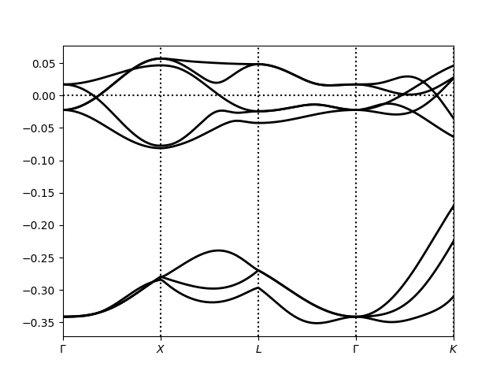

# linearized-augmented-plane-wave-method
A tutorial on the Linearized Augmented-Plane-Wave (LAPW) method for Density Functional Theory calculations.
# Acknowledgements
The resources in this repository are based on Kristjan Haule's DFT resources from his physics 509 course which can be found [here](https://www.physics.rutgers.edu/grad/509/) LAPW can be found in the DFT section of the course. More computational physics resources can be found in this [repository](https://github.com/haulek/CompPhysics/tree/main).
# Quickstart
```bash
git clone https://github.com/AdamZettel/linearized-augmented-plane-wave-method.git
cd linearized-augmented-plane-wave-method
python3 lapw.py
```
## Band Structure
After running the code you should see a band structure that looks something like this. This band structure is not correct because the convergence criteria for the energy is set at 1 eV. The original setting was 1e-5, but in order to get the code to run quickly I increased the tolerance.


